# 2025年海南省中考地理试题题库

- 35道选择题，3道综合题，满分100分。

## 第1题（2分）

在晴朗的早晨或傍晚，我们可以看到朝霞或晚霞，这是太阳光照射在云层上形成的。读太阳光照示意图，完成下面小题。

我们看到的朝霞或晚霞，与这种自然现象有关的是（ ）

A. 地球自转
B. 地球公转
C. 月球自转
D. 月球公转

**参考答案：** A

## 第2题（2分）

在晴朗的早晨或傍晚，我们可以看到朝霞或晚霞，这是太阳光照射在云层上形成的。读太阳光照示意图，完成下面小题。

此时，图中可能出现朝霞的位置是（ ）

A. 甲
B. 乙
C. 丙
D. 丁

**参考答案：** C

## 第3题（2分）

2025年中国农历蛇年春晚，重庆、西藏拉萨、湖北武汉、江苏无锡四个分会场与北京主会场共同为全球观众呈现一台中华民族一家亲的文化盛会。读中国疆域示意图，完成下面小题。

四个分会场所在城市对应的省级行政区简称，正确的是（ ）

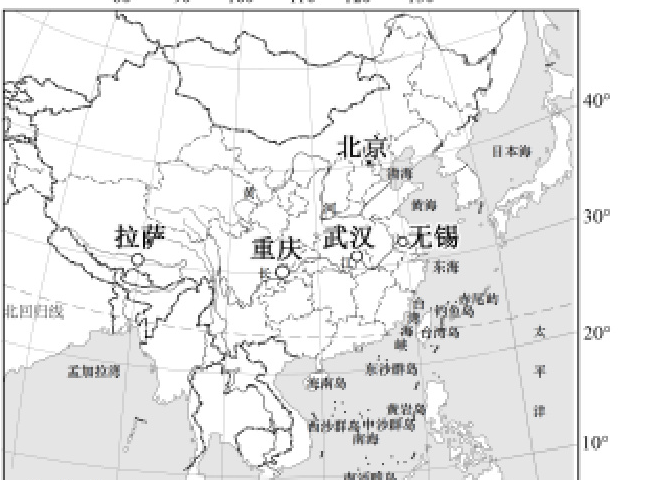

A. 重庆—川
B. 拉萨—青
C. 武汉—湘
D. 无锡—苏

**参考答案：** D

## 第4题（2分）

2025年中国农历蛇年春晚，重庆、西藏拉萨、湖北武汉、江苏无锡四个分会场与北京主会场共同为全球观众呈现一台中华民族一家亲的文化盛会。读中国疆域示意图，完成下面小题。

中国的钓鱼岛、黄岩岛分别位于（ ）

A. 渤海、黄海
B. 东海、南海
C. 黄海、东海
D. 黄海、南海

**参考答案：** B

## 第5题（2分）

气象观测表明，全球气候确实有变暖的趋势，近百年来全球平均气温上升了0.4—0.8℃。读所示漫画，完成下面小题。

全球气候变暖造成的影响有（ ）

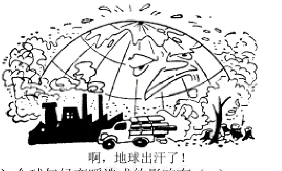

A. 极地冰川扩大
B. 陆地面积增多
C. 沿海滩涂增大
D. 海平面上升

**参考答案：** D

## 第6题（2分）

气象观测表明，全球气候确实有变暖的趋势，近百年来全球平均气温上升了0.4—0.8℃。读所示漫画，完成下面小题。

面对漫画反映的环境问题，我们在日常生活中正确的做法是（ ）

A. 垃圾混装投放
B. 增加碳的排放
C. 节约用电用水
D. 使用一次性餐具

**参考答案：** C

## 第7题（2分）

孔子学院（课堂）在世界各地传播中华优秀传统文化。读世界部分孔子学院（课堂）分布示意图，完成下面小题。

图中孔子学院（课堂）的分布，叙述正确的是（ ）

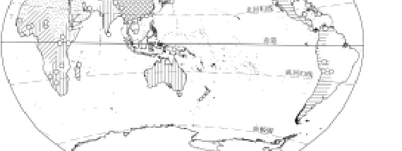

A. 大洋洲多于非洲
B. 欧洲多于北美洲
C. 南半球多于北半球
D. 北美洲少于南美洲

**参考答案：** B

## 第8题（2分）

孔子学院（课堂）在世界各地传播中华优秀传统文化。读世界部分孔子学院（课堂）分布示意图，完成下面小题。

建立孔子学院（课堂）可以（ ）

A. 促进中外文化交流
B. 改变区域人口分布
C. 促进世界人口增长
D. 改善交通设施建设

**参考答案：** A

## 第9题（2分）

人类对地球形状的认识是一个漫长的探索历程。确证地球是一个球体的是（ ）

A. 古人认为天圆地方
B. 地球卫星照片
C. 太阳、月亮的形状
D. 郑和下西洋

**参考答案：** B

## 第10题（2分）

拉丁美洲国家积极响应共建“一带一路”倡议，其与中国的合作属于（ ）

A. 南北合作
B. 南北对话
C. 南南合作
D. 南南对话

**参考答案：** C

## 第11题（2分）

读表《中国人口统计表》，完成下面小题。

据表，下列选项正确的是（ ）

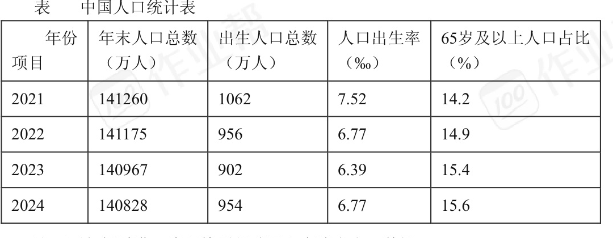

A. 2021年年末人口总数最少
B. 2022年出生人口总数最多
C. 2023年人口出生率最高
D. 2024年65岁及以上人口占比最高

**参考答案：** D

## 第12题（2分）

读表《中国人口统计表》，完成下面小题。

为应对表中人口变化，我国采取的措施有（ ）
①不断调整生育政策 ②大量接收外来移民 ③进一步完善养老保障体系 ④改变人口分布格局

A. ①②
B. ①③
C. ②③
D. ③④

**参考答案：** B

## 第13题（2分）

七大洲中，关于亚洲描述正确的是（ ）

A. 面积最大
B. 气候类型单一
C. 地势起伏小
D. 江河水量小

**参考答案：** A

## 第14题（2分）

粤港澳大湾区建设，使香港、澳门特别行政区进一步与祖国内地融合发展。对此表述正确的是（ ）
①港澳为内地提供矿产资源 ②促进港澳多元经济发展 ③促进澳门自由贸易港建设 ④内地向港澳提供广阔市场

A. ①②
B. ②④
C. ①③
D. ③④

**参考答案：** B

## 第15题（2分）

机器人是高新技术产业发展的重要产品，被广泛应用于我国经济建设和人们日常生活。读国家级高新技术产业开发区所在地分布示意图，完成下面小题。

我国四大工业基地中，国家级高新技术产业开发区分布数量最多的是（ ）

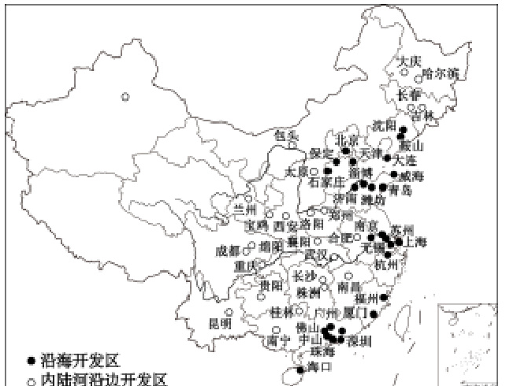

A. 辽中南工业基地
B. 京津唐工业基地
C. 长江三角洲工业基地
D. 珠江三角洲工业基地

**参考答案：** C

## 第16题（2分）

机器人是高新技术产业发展的重要产品，被广泛应用于我国经济建设和人们日常生活。读国家级高新技术产业开发区所在地分布示意图，完成下面小题。

机器人被广泛应用，主要得益于我国（ ）

A. 科学技术迅速发展
B. 交通运输迅速发展
C. 人口数量不断增多
D. 地域之间环境差异大

**参考答案：** A

## 第17题（2分）

台风主要源自热带洋面，多发于夏秋季节。2024年超强台风“摩羯”给海南带来严重灾害，警示人们须提高防灾意识。完成下面小题。

台风致灾的主要因素有（ ）
①狂风 ②低温 ③暴雨 ④干旱

A. ①②
B. ②③
C. ③④
D. ①③

**参考答案：** D

## 第18题（2分）

台风主要源自热带洋面，多发于夏秋季节。2024年超强台风“摩羯”给海南带来严重灾害，警示人们须提高防灾意识。完成下面小题。

台风来临时，下列做法正确的是（ ）

A. 前往安全场所避险
B. 在广告牌下面躲雨
C. 在海边观海景
D. 在地势低洼处避风

**参考答案：** A

## 第19题（2分）

为促进水资源再利用，某中学地理学习小组开展“浑浊水净化科学实验”探究。完成该实验，以下探究环节顺序正确的是（ ）
①准备盛水器皿、过滤网等 ②规划方案、设计流程 ③展示交流水资源再利用的做法 ④操作实验，记录结果

A. ①→②→③→④
B. ②→③→①→④
C. ②→①→④→③
D. ①→④→②→③

**参考答案：** C

## 第20题（2分）

根据浑浊水净化后可再利用的实验结果，提醒我们应该（ ）

A. 提倡一水多用
B. 把垃圾倒入河里
C. 多用化学洗涤剂
D. 浑浊水直接排放

**参考答案：** A

## 第21题（2分）

“高原夏菜”是指夏季在气候冷凉的地区生长的蔬菜。甘肃依托当地优势在夏季种植蔬菜，这些新鲜的“高原夏菜”48小时内就能运达长江三角洲地区，完成下面小题。

与长江三角洲地区相比，甘肃发展“高原夏菜”的突出优势是（ ）

A. 降水丰沛
B. 昼夜温差大
C. 热量充足
D. 地形崎岖

**参考答案：** B

## 第22题（2分）

“高原夏菜”是指夏季在气候冷凉的地区生长的蔬菜。甘肃依托当地优势在夏季种植蔬菜，这些新鲜的“高原夏菜”48小时内就能运达长江三角洲地区，完成下面小题。

新鲜的“高原夏菜”能快速从甘肃运达长江三角洲地区，主要得益于（ ）
①高速公路网络发达 ②距离消费市场近 ③冷藏保鲜技术发展 ④水路交通便利

A. ①②
B. ③④
C. ①③
D. ②④

**参考答案：** C

## 第23题（2分）

读海南岛主要河流分布示意图，完成下面小题。

海南岛最长的河流是（ ）

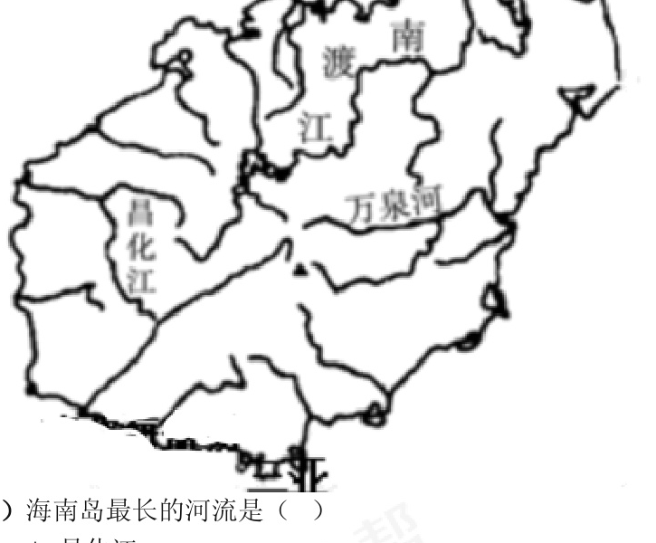

A. 昌化江
B. 万泉河
C. 陵水河
D. 南渡江

**参考答案：** D

## 第24题（2分）

读海南岛主要河流分布示意图，完成下面小题。

根据河流流向推测，海南岛的地势特征是（ ）

A. 东高西低
B. 北高南低
C. 中高周低
D. 中低周高

**参考答案：** C

## 第25题（2分）

为实现我国耕海牧渔可持续发展，下列做法正确的是（ ）

A. 投放人工鱼礁，建设海洋牧场
B. 减少红树林，扩大养殖面积
C. 减少珊瑚礁，扩大牧渔范围
D. 加大捕捞强度，增加渔获量

**参考答案：** A

## 第26题（2分）

古诗“黄梅时节家家雨，青草池塘处处蛙”，描述的是我国江淮地区梅雨时节经常出现的景象。完成下面小题。

“黄梅时节家家雨”常出现的季节是（ ）

A. 春季
B. 夏季
C. 秋季
D. 冬季

**参考答案：** B

## 第27题（2分）

古诗“黄梅时节家家雨，青草池塘处处蛙”，描述的是我国江淮地区梅雨时节经常出现的景象。完成下面小题。

图中符合诗句描述地区的传统民居是（ ）

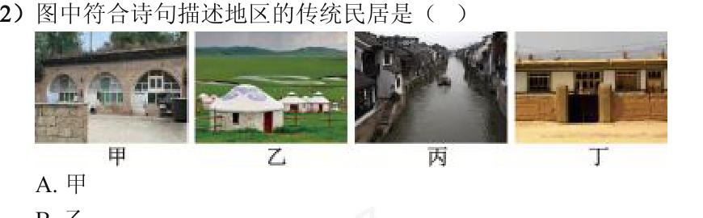

A. 甲
B. 乙
C. 丙
D. 丁

**参考答案：** C

## 第28题（2分）

读美国、巴西示意图，完成下面小题。

两国共同的自然环境特征是（ ）

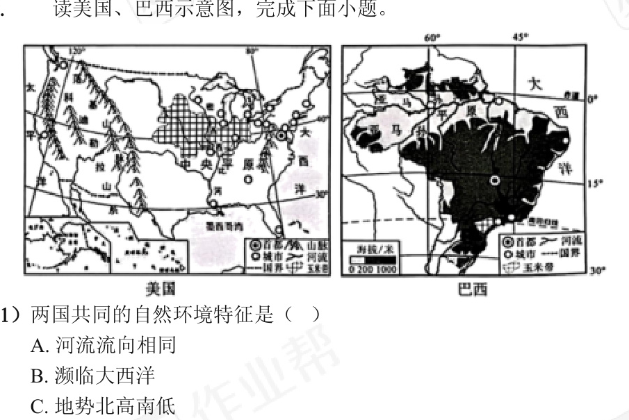

A. 河流流向相同
B. 濒临大西洋
C. 地势北高南低
D. 位于北半球

**参考答案：** B

## 第29题（2分）

读美国、巴西示意图，完成下面小题。

与美国东北部相比，巴西东北部（ ）

A. 城市集中
B. 工业发达
C. 交通便利
D. 人口稀少

**参考答案：** D

## 第30题（2分）

黄河流域生态保护和高质量发展坚持生态优先、绿色发展。读黄河流域示意图，完成下面小题。

关于黄河干流叙述正确的是（ ）

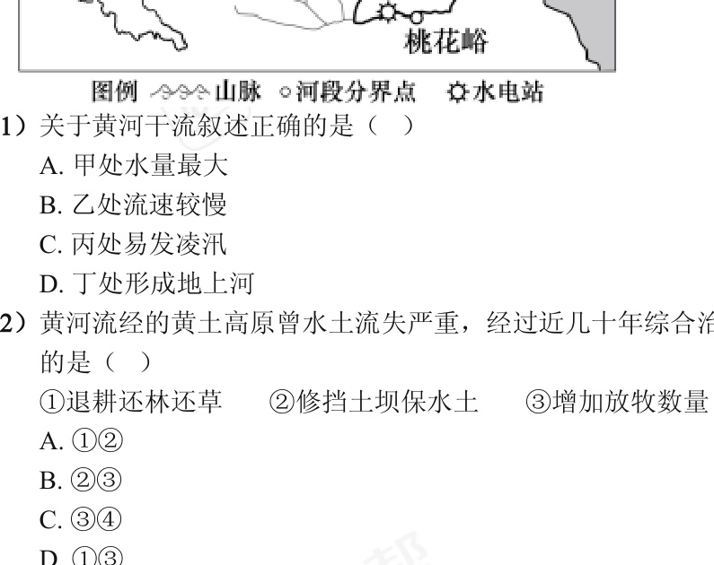

A. 甲处水量最大
B. 乙处流速较慢
C. 丙处易发生凌汛
D. 丁处形成地上河

**参考答案：** D

## 第31题（2分）

黄河流域生态保护和高质量发展坚持生态优先、绿色发展。读黄河流域示意图，完成下面小题。

黄河流经的黄土高原曾水土流失严重，经过近几十年综合治理，黄土高原变绿了，黄河水变清了。下列治理措施有效的是（ ）
①退耕还林还草 ②修挡土坝保水土 ③增加放牧数量 ④陡坡地扩耕地

A. ①②
B. ②③
C. ③④
D. ①③

**参考答案：** A

## 第32题（2分）

2025年5月28日，“雪龙2”号极地考察破冰船抵达海南海口，标志着中国第41次南极考察队顺利完成全部考察任务。读北极、南极地区示意图，完成下面小题。

两极地区科学考察的共性是（ ）

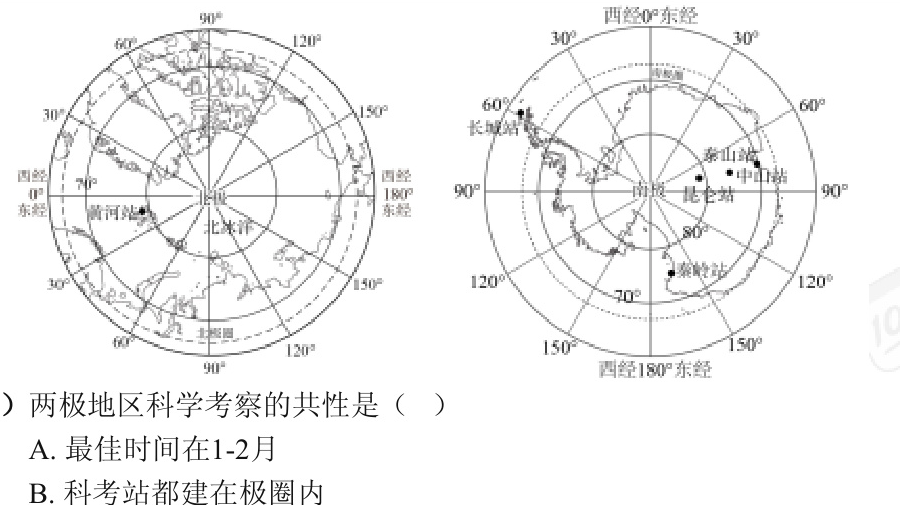

A. 最佳时间在1—2月
B. 科考站都建在极圈内
C. 考察企鹅生活环境
D. 研究全球气候变化

**参考答案：** D

## 第33题（2分）

2025年5月28日，“雪龙2”号极地考察破冰船抵达海南海口，标志着中国第41次南极考察队顺利完成全部考察任务。读北极、南极地区示意图，完成下面小题。

秦岭站位于黄河站的（ ）

A. 东南方
B. 正南方
C. 西南方
D. 西北方

**参考答案：** A

## 第34题（2分）

读某大陆甲、乙两地气候资料图，完成下面小题。

影响甲、乙两地降水差异的主要因素是（ ）

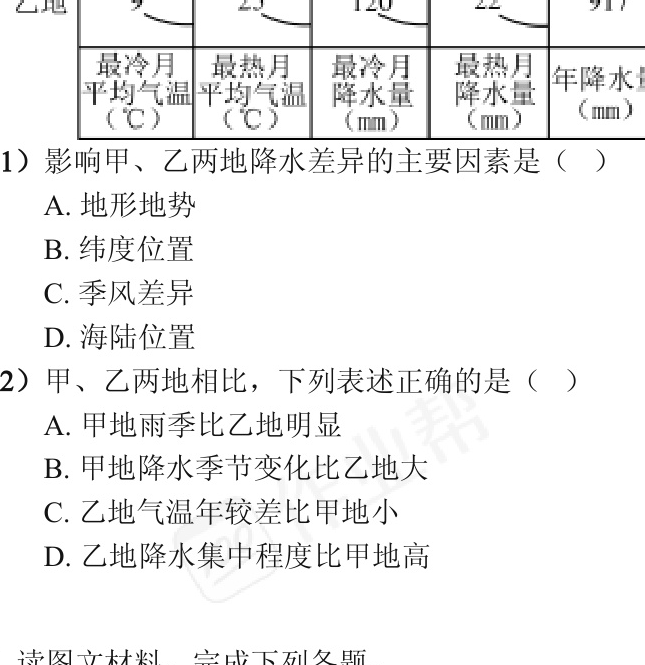

A. 地形地势
B. 纬度位置
C. 季风差异
D. 海陆位置

**参考答案：** B

## 第35题（2分）

读某大陆甲、乙两地气候资料图，完成下面小题。

甲、乙两地相比，下列表述正确的是（ ）

A. 甲地雨季比乙地明显
B. 甲地降水季节变化比乙地大
C. 乙地气温年较差比甲地小
D. 乙地降水集中程度比甲地高

**参考答案：** D

## 第36题（10分）

材料一：“21世纪海上丝绸之路”是中国连接东南亚、南亚、西亚、非洲和欧洲的海上通道。图（I）为“一带一路”示意图，图（II）为亚吉铁路示意图。材料二：亚吉铁路是中国援建东非地区的首条电气化铁路，为沿线地区经济发展带来强劲的动力。

（1）“21世纪海上丝绸之路”加强了东南亚与中国的合作联系。东南亚是连接太平洋与____洋的重要海上通道，其向中国出口大量热带农产品的有利条件有____（答出两点即可）。
（2）印度半岛夏季风不稳定，既带来丰沛降水，又带来____灾害。印度半岛东北部的乞拉朋齐是世界“雨极”，而同纬度的印度西北部和巴基斯坦东南部降水却稀少，主要原因是____（答出两点即可）。
（3）撒哈拉以南非洲是____人种的故乡。我国工程人员援建亚吉等东非地区铁路过程中，需要克服的气候困难是____。简述中国援建亚吉铁路对当地经济社会发展的积极意义____（答出两点即可）。

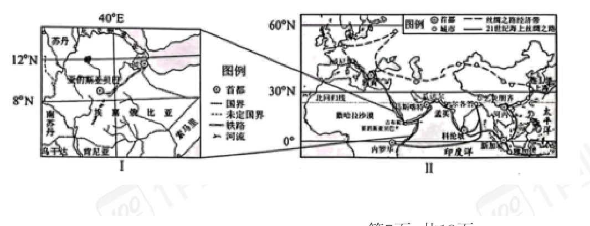

**参考答案：** （1）印度；以热带气候为主，热量充足、降水丰沛，适宜热带作物生长；种植历史悠久、产量大等。
（2）旱涝；乞拉朋齐位于西南季风的迎风坡，受地形抬升作用多地形雨；西北部受地形阻挡，西南季风难以深入。
（3）黑色；高温、干旱（或雨季湿热）；改善当地交通条件，促进物资运输与人员往来，带动相关产业发展、增加就业和收入等。

## 第37题（10分）

材料一：华北地区水资源短缺，影响当地生产生活。2024年是南水北调东、中线一期工程全面通水十周年。材料二：读南水北调及中国四大地理区域示意图。

（1）南水北调工程的东、中线路都穿过四大地理区域的①②两区，其分界线甲是____山脉。③地区最突出的自然环境特征是____。④地区的宁夏平原、河套平原被誉为“塞上江南”，其发展灌溉农业的优势有____（答出两点即可）。
（2）南水北调工程中的“南水”是来自____流域丰富的水资源，“北调”至华北地区。分析华北地区缺水的主要原因____（从自然和社会两方面作答）。
（3）南水北调中线从丹江口水库到华北地区，利用地势____的特征，实现了自流调水。中线在京、津段多采用地下埋管的输水方式，其目的是____（答出两点即可）。

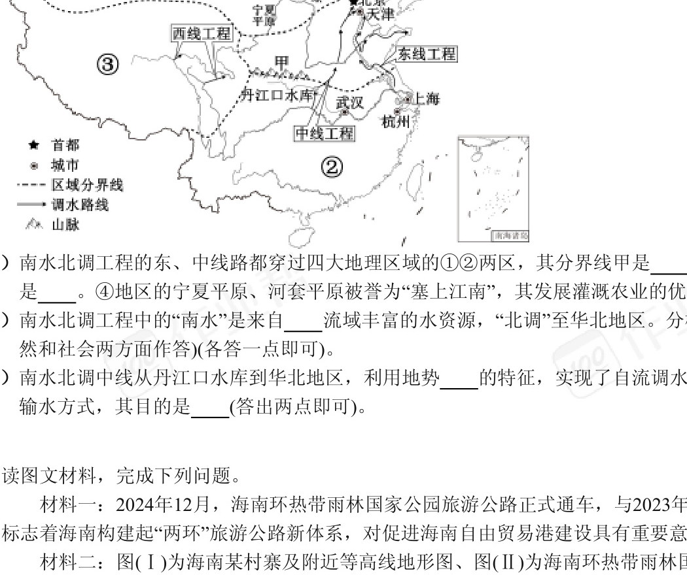

**参考答案：** （1）秦岭；高寒；依托黄河获得灌溉水源，光照充足、昼夜温差大。
（2）长江；位于半湿润地区，降水总量少；人口和城市集中，生产生活用水量大。
（3）南高北低；减少蒸发耗水，降低外界污染，节约地面空间。

## 第38题（10分）

材料一：2024年12月，海南环热带雨林国家公园旅游公路正式通车，与海南环岛旅游公路相得益彰。材料二：图（I）为海南某村寨及附近等高线地形图，图（II）为海南环热带雨林国家公园旅游公路分布示意图。

（1）图（I）中，村寨所处的地形类型是____，公路呈“Z”字型的影响因素是____。防火瞭望台与村寨位置相比，坡度较陡的是____，判断依据是____。
（2）海南热带雨林国家公园位于海南岛的____地区，建设该公园的优势条件有____（答出两点即可）。
（3）海南环热带雨林国家公园旅游公路选线环绕____修建。“两环”旅游公路的建成，推动了海南自由贸易港建设，对促进乡村振兴的意义有____（答出两点即可）。

**参考答案：** （1）盆地；地形；防火瞭望台；附近等高线更密集，等高线密集表示坡度陡。
（2）中部；热带雨林面积大、生物多样性丰富，气候湿热，适合热带雨林植被生长。
（3）海南热带雨林国家公园；带动乡村旅游发展、增加农民收入，完善乡村交通和服务设施，提供就业岗位、促进乡村经济发展等。
