# 一本地理生地会考预测卷题库

## 1. 天问二号探测器在轨稳定飞行235天时，太阳直射点最接近

> 截至2026年1月19日，天问二号探测器已在轨稳定飞行235天，科研团队正持续接收其从4000多万千米外传回的科学数据。今年天问二号将飞抵目标小行星2016HO3开展探测与采样，预计2027年底完成样品采集返回地球。读天问二号任务示意图，完成1-3题。

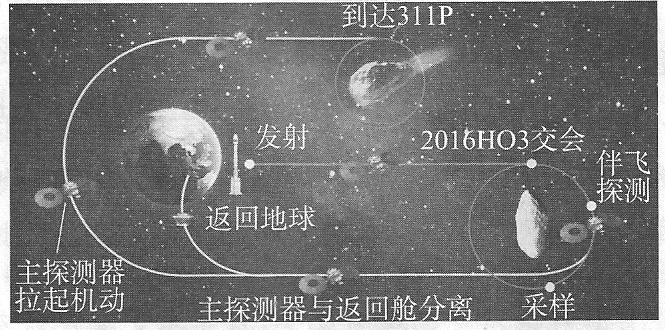

- A. 20°N
- B. 30°S
- C. 20°S
- D. 30°N

**答案：** C

## 2. 该日，首都北京

> 读天问二号任务示意图，完成1-3题。

- A. 昼短夜长
- B. 昼长夜短
- C. 昼夜平分
- D. 出现极昼

**答案：** A

## 3. 天问二号探测器将实施小行星2016HO3伴飞、采样、返回任务，这体现了

> 读天问二号任务示意图，完成1-3题。

- A. 我国科技领先世界所有国家
- B. 我国对宇宙的研究已十分透彻
- C. 我国的小行星研究绝对领先
- D. 我国取得太空探索技术的突破

**答案：** D

## 4. 图中村落

> 重庆市民间文物保护组织举行了一次本地考察活动，活动设定的区域范围等高线分布如图所示。据此完成4-6题。

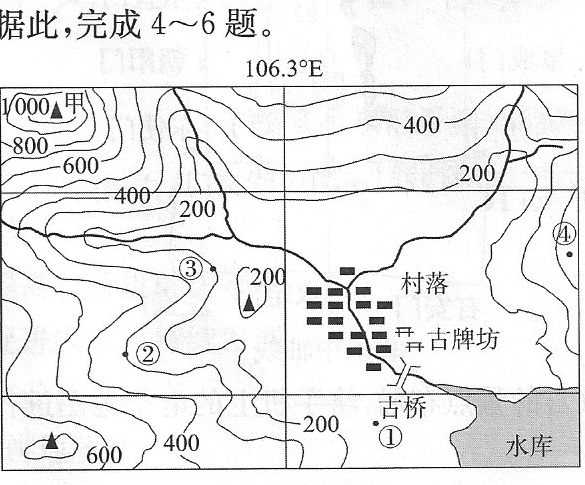

- A. 位于高原上
- B. 沿河流分布
- C. 位于南温带
- D. 位于甲山北方

**答案：** B

## 5. 如果只考虑海拔因素，当古桥上气温为28℃时，①②③④处气温可能是26℃的是

> 读村落周边等高线分布示意图，完成4-6题。

- A. ①
- B. ②
- C. ③
- D. ④

**答案：** D

## 6. 图中村落因多古祠堂、古民居、古牌坊等吸引了众多文物保护爱好者的关注，领队想要拍摄村落全貌，在①②③④处应选择的最佳拍摄地点是

> 读村落周边等高线分布示意图，完成4-6题。

- A. ①
- B. ②
- C. ③
- D. ④

**答案：** D

## 7. 据表可知，第五次全国人口普查以来，我国人口年龄结构的变化特征是

> 下表为我国第五次至第七次人口普查的年龄结构。据此完成7-8题。

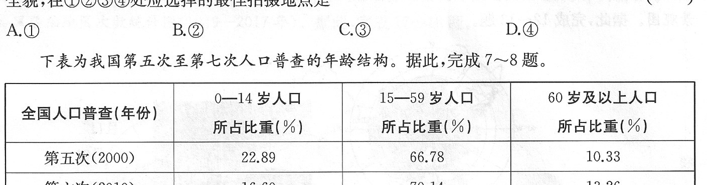

- A. 0-14岁人口比重先升后降
- B. 15-59岁人口比重先降后升
- C. 60岁及以上人口比重持续上升
- D. 各年龄段人口比重均持续上升

**答案：** C

## 8. 基于我国人口年龄结构的变化，未来20年我国需：①逐步完善城乡养老服务体系；②鼓励和支持适龄夫妻按政策生育；③发展劳动力需求量大的产业；④扩大各类婴幼儿消费品生产规模。

> 下表为我国第五次至第七次人口普查的年龄结构。据此完成7-8题。

- A. ①②
- B. ③④
- C. ①③
- D. ②④

**答案：** A

## 9. 影响中亚降水的主要因素是

> 自2025年1月1日起，哈萨克斯坦、乌兹别克斯坦等国正式成为金砖伙伴国。图1为中亚地区简图，图2为哈萨克斯坦某城市气候统计图。据此完成9-11题。

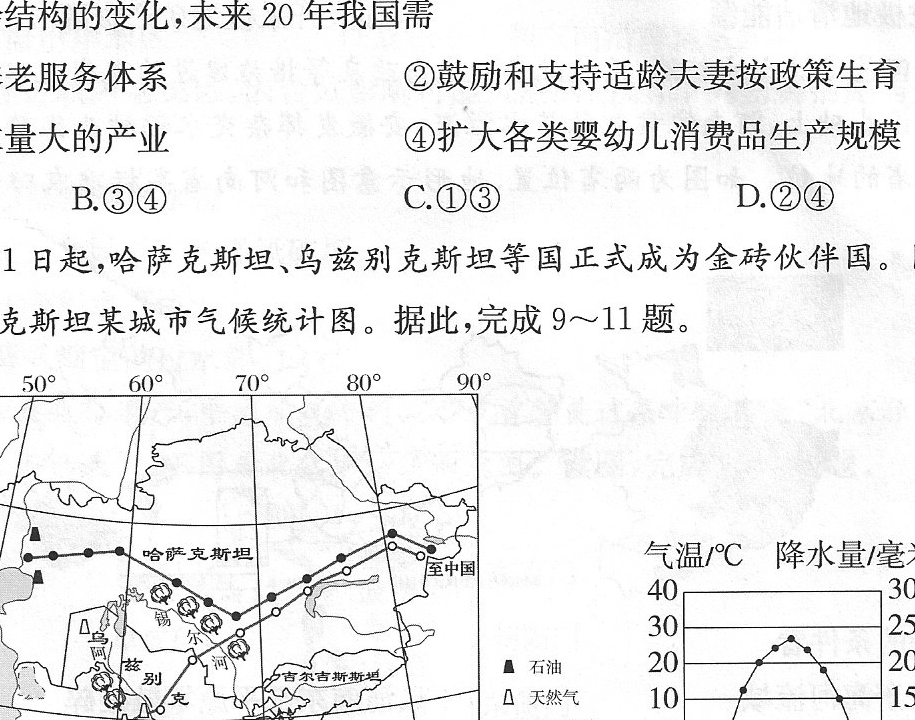

- A. 纬度位置
- B. 海陆位置
- C. 地形地势
- D. 人类活动

**答案：** B

## 10. 关于哈萨克斯坦的叙述，正确的是

> 读中亚地区简图和哈萨克斯坦某城市气候统计图，完成9-11题。

- A. 位于中亚南部
- B. 东侧濒临里海
- C. 阿姆河流经全境
- D. 棉花量大质优

**答案：** D

## 11. 中国从中亚进口油气资源的主要运输方式是

> 读中亚地区简图和哈萨克斯坦某城市气候统计图，完成9-11题。

- A. 铁路运输
- B. 海洋运输
- C. 公路运输
- D. 管道运输

**答案：** D

## 12. “水滴形”风机需要适应的环境不包括

> 2025年3月1日，我国在秦岭站建设的首个规模化新能源系统“水滴形”风机正式启用，这是我国为适应南极环境研发的风能设备。下图分别为我国南极科学考察站分布图和“水滴形”风机景观图。据此完成12-13题。

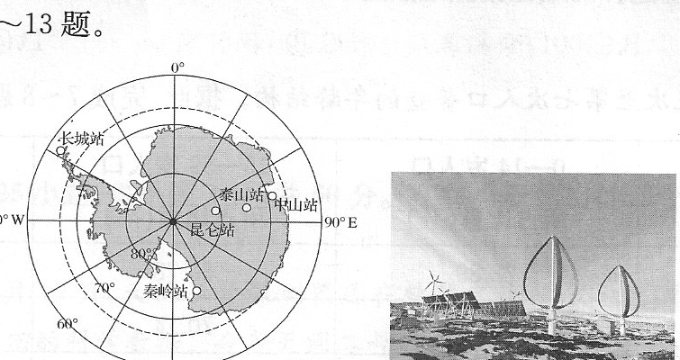

- A. 暴雨
- B. 低温
- C. 烈风
- D. 干燥

**答案：** A

## 13. “水滴形”风机保障了极地科考的纯绿色运行，下列做法与其目的一致的是

> 读我国南极科学考察站分布图和“水滴形”风机景观图，完成12-13题。

- A. 大力开发南极旅游资源
- B. 大量捕捞南极渔业资源
- C. 配套开发极地清洁能源
- D. 加大开采极地矿产资源

**答案：** C

## 14. 从农业发展的条件看

> 高标准农田是通过土地整治、设施配套和生态改良等措施建设的现代化农田。近年来，河南依靠智慧节水灌溉，安徽发挥杂交水稻种业优势，不断巩固其作为国家粮食生产大省的地位。读两省位置、地形示意图和河南省高标准农田景观图，完成14-16题。

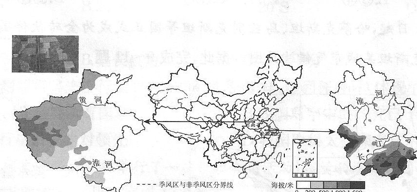

- A. 两省均位于海河流域
- B. 河南东部平原零散破碎
- C. 两省水热条件配合好
- D. 安徽南部平原集中连片

**答案：** C

## 15. 高标准农田建设的主要目的是：①田成方、路相通、渠相连，提高农业机械化水平；②提高农业抗灾减灾能力，促进农业可持续发展；③大量使用化肥农药，实现农业高产稳产；④改良土壤、合理灌溉，提高耕地质量。

> 读两省位置、地形示意图和河南省高标准农田景观图，完成14-16题。

- A. ①②③
- B. ①③④
- C. ②③④
- D. ①②④

**答案：** D

## 16. 为巩固国家粮食安全，两省未来的努力方向是

> 读两省位置、地形示意图和河南省高标准农田景观图，完成14-16题。

- A. 科技创新，高效利用土地资源
- B. 安徽加大热带水果育种
- C. 建立预警机制，消除灾害天气
- D. 河南扩大水稻种植面积

**答案：** A

## 17. 据图分析我国台风的分布规律，可知我国台风多发季节与主要登陆地区分别是

> 我国是世界上受台风影响较频繁的国家之一。图1为我国台风登陆月次数统计图（1949-2023年），图2为我国台风登陆地区次数统计图（1949-2017年）。据此完成17-18题。

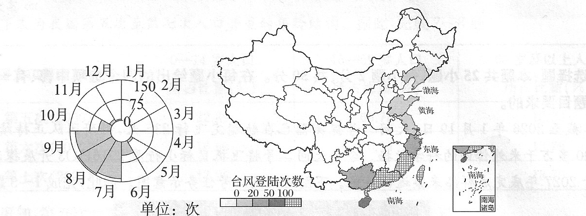

- A. 夏秋季节和东海、黄海沿岸地区
- B. 春夏季节和东南沿海地区
- C. 春夏季节和东海、黄海沿岸地区
- D. 夏秋季节和东南沿海地区

**答案：** D

## 18. 针对某城镇（乡村）低洼区域内居民区，因台风影响可能被淹的问题，下列防御措施与作用匹配正确的是

> 读我国台风登陆月次数和登陆地区次数统计图，完成17-18题。

- A. 修建防洪堤——控制低洼地区水位
- B. 修建排水管网——减少台风带来的强风破坏
- C. 种植防风林——让地面积水更快消失
- D. 清理河道淤泥——降低河道的过水能力

**答案：** A

## 19. 研学时，同学们想具体了解故宫的景点布局，将手机上的电子地图进行了放大操作，此时手机显示的电子地图

> 北京中轴线是我国重要文化遗产。下图为北京中轴线示意图。读图，完成19-20题。

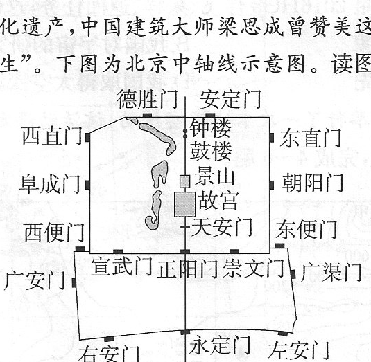

- A. 图幅变大
- B. 图幅变小
- C. 比例尺变大
- D. 比例尺变小

**答案：** C

## 20. 北京中轴线入选《世界遗产名录》，将更加凸显北京是

> 读北京中轴线示意图，完成19-20题。

- A. 全国的文化中心
- B. 全国的政治中心
- C. 国际交往中心
- D. 全国的科技创新中心

**答案：** A

## 21. 台湾岛

> 港澳与台湾在历史、政治、经济、文化等方面均与祖国大陆有着广泛而密切的联系。读海峡两岸示意图及粤港澳大湾区分布示意图，完成21-23题。

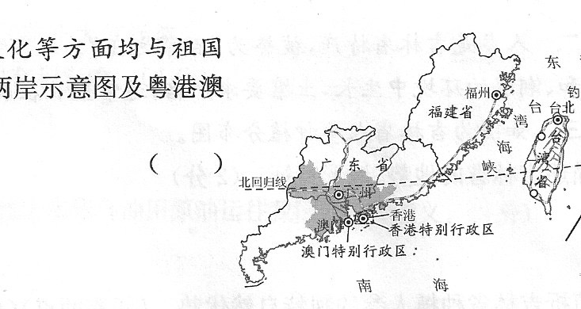

- A. 隔台湾海峡与广东、福建省相望
- B. 受地形影响，铁路线呈环状分布
- C. 受陆地面积影响，河流短小湍急
- D. 东部平坦开阔，人口城市较集中

**答案：** B

## 22. 与内地相比，粤港澳大湾区最独特的发展优势是

> 读海峡两岸示意图及粤港澳大湾区分布示意图，完成21-23题。

- A. 空置土地较多，租金便宜
- B. 工农业基础好，科技发达
- C. 海陆交通便捷，江海联运
- D. 著名的侨乡，吸引外资

**答案：** D

## 23. 港澳台的共同特征是

> 读海峡两岸示意图及粤港澳大湾区分布示意图，完成21-23题。

- A. 整体地狭人稠
- B. 文化一脉相承
- C. 世界航运中心
- D. 扼守台湾海峡

**答案：** B

## 24. 芒康县成为优质葡萄产区的自然条件有：①位于河谷，海拔较低，气温较高；②属高原山地气候，昼夜温差大；③空气稀薄，光照强；④全年少雨，夏季有冰雪融水灌溉。

> 西藏自治区的芒康县是世界上海拔较高的葡萄种植区之一，芒康葡萄品质优良，已获得国家农产品地理标志认证。下图为芒康县位置示意图和各月多年平均降水量统计图。读图，完成24-25题。

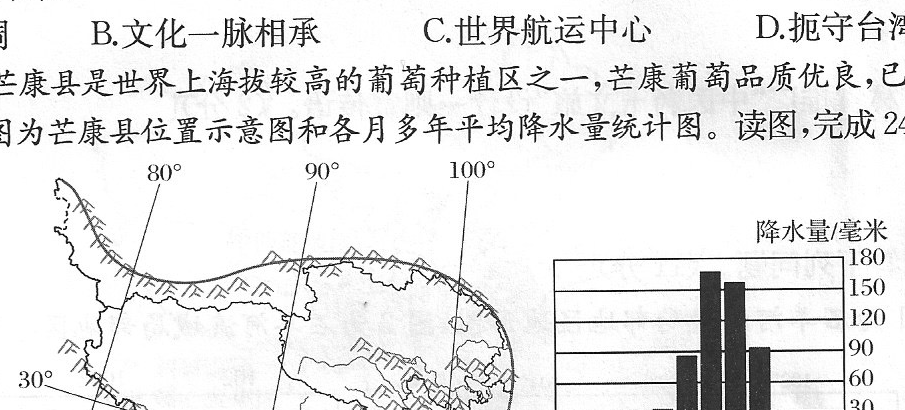

- A. ①②③
- B. ①②④
- C. ①③④
- D. ①②③④

**答案：** A

## 25. 为促进芒康县葡萄产业的可持续发展，以下措施可行的有：①优化种植技术，提高葡萄品质；②扩大种植面积，提高葡萄产量；③发展葡萄深加工，提高产品附加值；④降低营销成本，专注线下销售。

> 读芒康县位置示意图和各月多年平均降水量统计图，完成24-25题。

- A. ①②
- B. ③④
- C. ①③
- D. ②④

**答案：** C

## 26. 根据图文材料完成实验思考与实验结论：比较实验3分钟后a、b、c三处湿度的差异并说明因素；推测加高山体模型后b处湿度变化并说明原因；归纳欧洲和北美洲温带海洋性气候分布面积差异大的原因。

> 阅读图文材料，完成下列要求。实验背景：同学们在学习《世界的气候》时，发现温带海洋性气候在欧洲和北美洲同纬度的大陆西岸分布面积差异显著。为探究其原因，同学们设计了模拟实验。

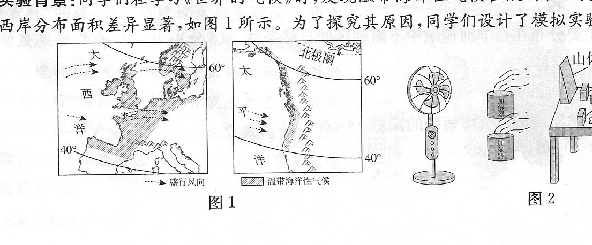

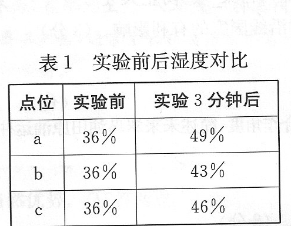

**答案：** （1）a处湿度最大，b处湿度最小（a>c>b）。影响三处湿度差异的因素有山体模型（或地形），与加湿器之间的距离（距离远近或海陆位置）。
（2）b处的湿度变小。因为山体模型加高阻挡了更多水汽，使到达b处的水汽减少。
（3）欧洲西部平原面积广大，有利于海洋湿润气流深入内陆，形成范围广大的温带海洋性气候；北美洲西部有南北走向的高大山脉，阻挡了海洋湿润气流深入内陆，温带海洋性气候只分布在沿海的南北狭长地带。

## 27. 根据图文材料，回答乌干达位置、绿色油田技术措施、输油管道影响及未来原油运往我国的意义。

> 长期以来，乌干达经济主要依赖传统农业，工业基础相对薄弱。中国某企业承建的翠鸟油田项目是乌干达首个商业石油项目。企业采用静音钻取技术、斜向取油技术和气体回收转化技术，努力打造“绿色油田”，并规划输油管道路。

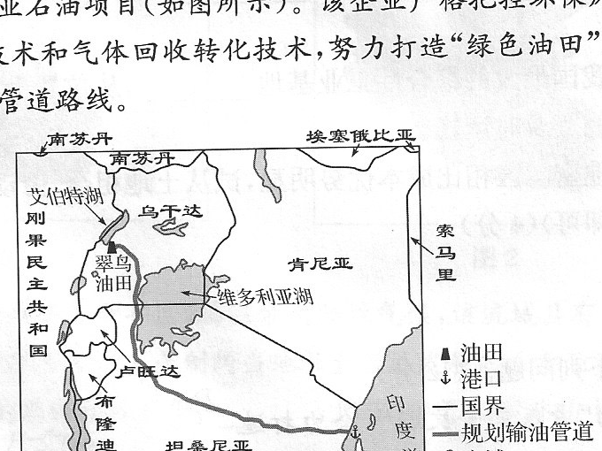

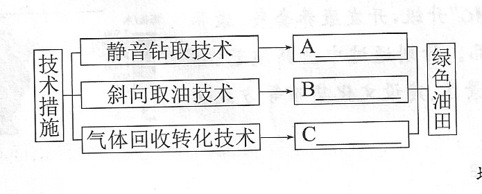

**答案：** （1）非；艾伯特。
（2）②、①、③。
（3）带动沿线国家经济发展；优化能源结构；完善基础设施；增加就业岗位；促进产业转型。
（4）能源安全角度：拓宽我国原油进口渠道，增加能源供应多样性，降低对单一地区原油进口的依赖，保障国家能源安全。国际合作角度：深化中非“一带一路”能源合作，促进跨国经济联动，同时推动我国技术、装备出海，提升我国在国际能源合作领域的影响力。

## 28. 据图归纳我国机器人产业分布特点和发展核心，说明泛长三角地区工业基础与中西部成本优势。

> 近年来，人工智能、5G、物联网等技术推动机器人产业崛起，我国已形成环渤海、长三角、珠三角等多个产业集聚区，中西部凭借成本优势加快产业布局。

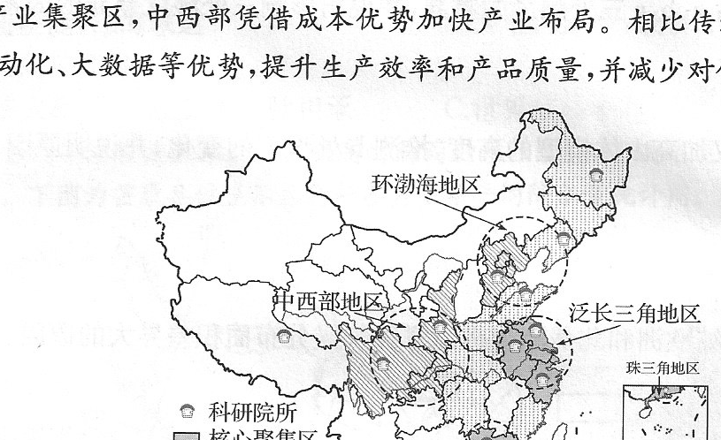

**答案：** （1）主要集中在东部地区；科技人才。
（2）长江三角洲工业基地；长江。
（3）中西部土地资源丰富，土地使用成本相对较低，能为机器人企业提供较大的发展空间和较为低廉的厂房租金；劳动力成本也低于东部地区，可降低企业的人力成本支出；中西部地区自然资源丰富，能为机器人产业发展提供所需的原材料和能源，降低原材料和能源成本，支持产业发展。

## 29. 描述吉林省地势、地形特征，分析人参种植优势，说明“中医药+文旅”产业融合影响，并设计宣传语。

> 吉林省推动“中医药+文旅”，全力打造“康养吉林”品牌。人参是吉林省特产，被誉为“百草之王”，适合在温和、潮湿、腐殖质丰富的森林土壤中生长。读吉林省人参种植分布图，完成问题。

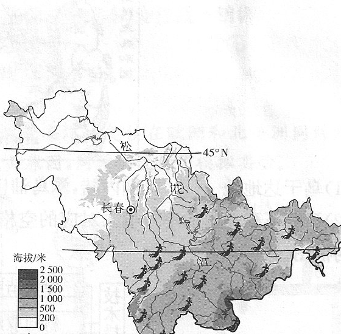

**答案：** （1）地势东南高、西北低；地形类型多样，以山地、平原为主。
（2）纬度较高，气候冷湿，符合人参喜阴湿的生长习性；以山地、丘陵地形为主，森林覆盖率高，能为人参提供遮阴环境；森林土壤腐殖质丰富，土质疏松肥沃，满足人参生长对土壤的要求。
（3）产业融合有利于延长产业链，提高经济效益；创造就业机会，增加居民收入；带动相关产业发展，促进产业结构优化升级；提升品牌影响力，拓展多元市场等。
（4）示例：康养吉林，“中医药+文旅”带你开启健康之旅；寻百草之王，享康养吉林；康养吉林，“中医药+文旅”带你开启身心疗愈之旅。

## 30. 根据图文材料，概括降水空间分布和景观类型，说明耕地分布在中下游的自然条件，并提出缓解水资源短缺的措施。

> 图1为石羊河流域局部地区地形图，图2为石羊河流域局部地区年降水量图。石羊河流域位于我国西北干旱区，属温带大陆性气候，具有典型的山地、绿洲和荒漠景观，水资源不足制约当地社会经济发展。

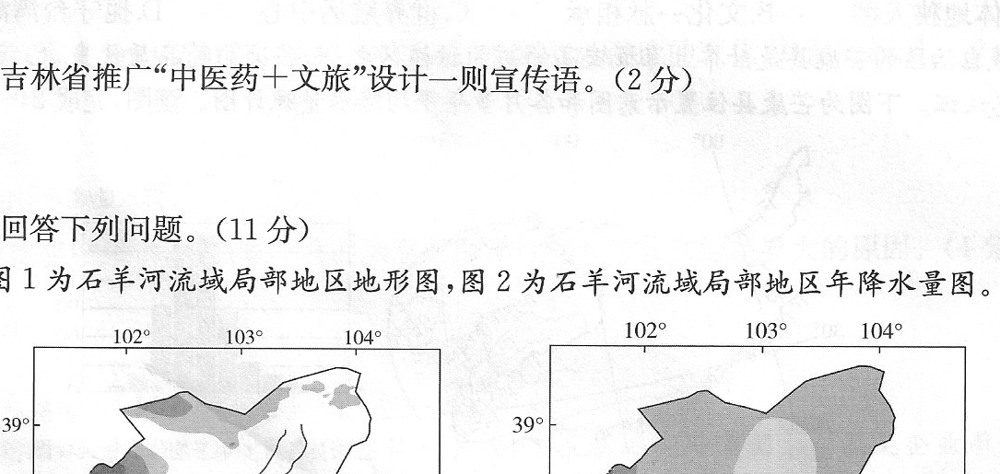

**答案：** （1）从西南向东北递减；荒漠、绿洲、山地。
（2）地势平坦，有大面积可供开垦的土地；河流经过，有较稳定的灌溉水源；海拔高，日照强，热量丰富，昼夜温差大，有利于农作物营养物质的积累。
（3）从水资源利用看，可建设节水农业灌溉等高效节水项目；同时关停用水量高的工业、发展节水工业等调整产业结构，提高用水效益。从针对流域水资源短缺的自然条件来看，可建设跨流域调水、水库调蓄工程，实施人工造林等生态建设项目。同时可制定与节水、治污、统一调配水资源等战略相适应的水价政策；完善石羊河流域用水法规体系，加强水资源统一管理，提高水资源利用率。
